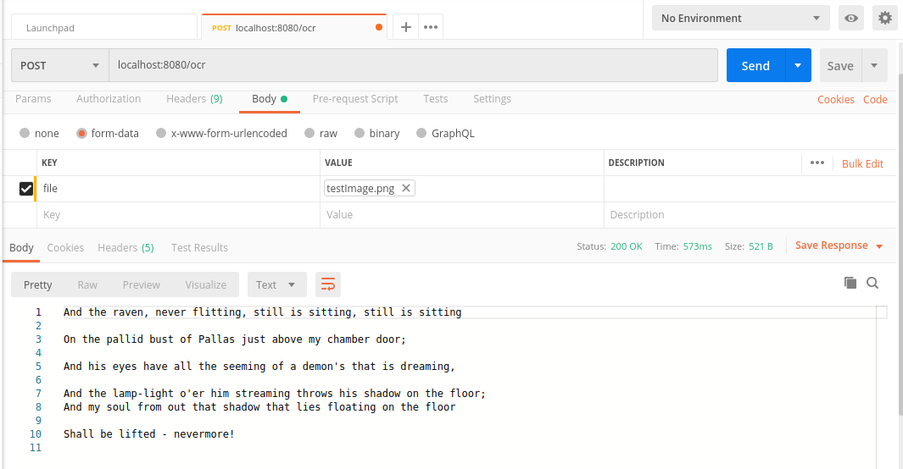

# Spring boot OCR

> Main source code can be found in : 3_SpringBoot_OCR_24_FEB/tesseract/src/main/java/com/example/demo/TesseractApplication.java
> 
> We have to manually give DataPath of tessdata folder in line 40 so that tesseract recognise language
> 
> tessdata folder is also uploaded in github in same folder with currently english language support

### After running the project, go to localhost:8080/ocr
### Choose POST request
### Then choose form data in Body and choose the file to upload

Picture for reference:

